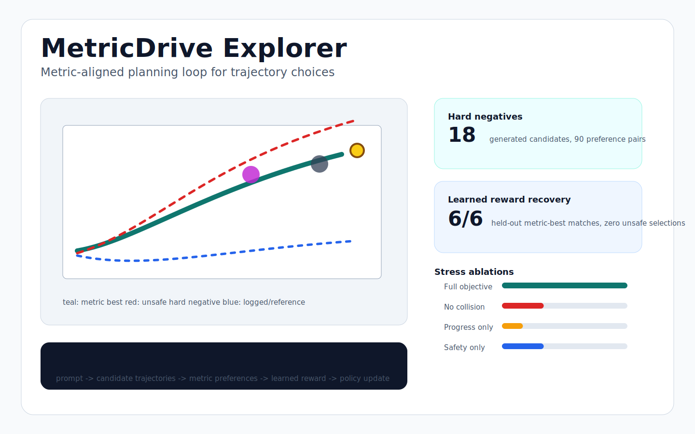

# MetricDrive

[](https://github.com/ethanvillalovoz/metricdrive/actions/workflows/ci.yml)
[](LICENSE)
[](pyproject.toml)

MetricDrive is a metric-aligned planning lab for autonomous-driving trajectory
choices. It turns long-tail driving scenarios into candidate trajectories,
interpretable planning metrics, preference rows, learned reward selections,
hard-negative stress tests, VLM-style planning examples, and a tiny
metric-reward post-training analogue.

- **Static demo:** [MetricDrive Explorer](https://ethanvillalovoz.github.io/metricdrive/)
- **Local demo files:** [docs/demo](docs/demo/)
- **Portfolio report:** [docs/reports/portfolio_report.md](docs/reports/portfolio_report.md)
- **Recruiting packet:** [docs/recruiting_packet.md](docs/recruiting_packet.md)



MetricDrive is Waymo-aligned in topic, but independent in implementation. It is
inspired by public research on multimodal/VLM driving planners, planning-metric
evaluation, preference alignment, and reward post-training. It does not use
private company data or claim affiliation with Waymo.

## Why This Exists

Autonomous-driving planners can look good under trajectory imitation while still
making the wrong tradeoff: pressing through a pedestrian crossing, squeezing a
merge, clipping a blocked lane, or over-braking when smoother safe progress is
available.

MetricDrive tests a small public analogue of a modern planning-alignment loop:

1. Represent the driving scene and candidate future ego trajectories.
2. Score candidates with transparent planning metrics.
3. Convert metric rankings into preference pairs.
4. Train a lightweight reward model from those preferences.
5. Add hard negatives that expose brittle objective terms.
6. Export VLM-style planning rows and optimize a tiny metric-reward policy.

## Why It Is Credible

| Proof point | Current status |
| --- | --- |
| Working planning harness | Six long-tail scenarios, candidate trajectories, metrics, SVG rendering, CLI, tests |
| Preference-alignment data | 90 metric-derived prompt/chosen/rejected rows with hard negatives |
| Learned reward evaluation | 89/90 pairwise fit, 6/6 held-out metric-best recovery, zero unsafe held-out selections |
| Stress testing | Hard-negative generation plus objective ablations that expose no-collision and progress-only failures |
| VLM/RL interface | Public-safe VLM JSONL examples and a tiny metric-reward post-training analogue |
| Public demo | Dependency-free GitHub Pages explorer generated from the same experiment data |
| Repo quality | MIT license, CI, contribution docs, citation file, release checklist, recruiter metadata |

## Quick Start

```bash
git clone https://github.com/ethanvillalovoz/metricdrive.git
cd metricdrive
python3 -m venv .venv
source .venv/bin/activate
python3 -m pip install -e ".[dev]"
metricdrive hard-negatives
python3 -m unittest discover
```

Preview the static explorer locally:

```bash
metricdrive export-demo --output docs/demo
python3 -m http.server 8000 --directory docs
```

Then open `http://localhost:8000/`.

## Research Surface

| Command | What it shows |
| --- | --- |
| `metricdrive score` | Metric-ranked candidate trajectories for synthetic long-tail scenarios |
| `metricdrive benchmark` | Imitation, progress-only, and metric-rerank planner baselines |
| `metricdrive preferences` | Metric-derived DPO-style preference pairs |
| `metricdrive learned` | Bradley-Terry learned reward model from trajectory preferences |
| `metricdrive ablations` | Objective-term failures under held-out evaluation |
| `metricdrive hard-negatives` | Generated trajectory negatives and stress-ablation results |
| `metricdrive vlm-examples` | Public-safe VLM planning prompt/chosen/rejected examples |
| `metricdrive rl-align` | Tiny metric-reward post-training analogue over candidate policies |
| `metricdrive export-demo` | Static GitHub Pages explorer with visual evidence |

## Current Results

The current public demo uses six synthetic long-tail scenario families and 36
candidate trajectories after hard-negative augmentation.

| Experiment | Result |
| --- | --- |
| Hard-negative preference set | 18 original candidates to 36 total candidates, 90 preference pairs |
| Learned reward on stress set | 89/90 pairwise preference fit |
| Held-out learned reward | 6/6 metric-best recovery, 0 unsafe selections |
| No-collision ablation | 2/6 held-out matches, 3 unsafe selections |
| Progress-only objective | 1/6 held-out matches, 5 unsafe selections |
| RL-aligned policy analogue | 6/6 metric-best recovery, 0 unsafe selections |
| Token-match imitation proxy | 0/6 metric-best recovery, 6 unsafe selections |

## Public Evidence

- [MetricDrive Explorer demo source](docs/demo/)
- [VLM planning JSONL examples](docs/examples/vlm_planning_examples.jsonl)
- [Portfolio report](docs/reports/portfolio_report.md)
- [Milestone 1: synthetic scenario core](docs/reports/milestone_1.md)
- [Milestone 2: baseline planner benchmark](docs/reports/milestone_2.md)
- [Milestone 3: metric-derived preferences](docs/reports/milestone_3.md)
- [Milestone 3B: learned preference model](docs/reports/milestone_3_learned_model.md)
- [Milestone 3C: objective ablations](docs/reports/milestone_3_ablation_study.md)
- [Milestone 3D: hard negative stress test](docs/reports/milestone_3_hard_negatives.md)
- [Research spec](docs/research_spec.md)
- [Related-work notes](docs/related_work.md)

## Why This Is Waymo-Relevant

Waymo's public research ecosystem includes scenario evaluation, motion
forecasting, simulation, multimodal planning, and safety-oriented metrics.
MetricDrive focuses on a narrow public slice of that world: how a planner can
prefer safer trajectory choices when logged imitation or progress alone is not
the right objective.

The project is deliberately laptop-scale. It is meant to be readable, runnable,
and honest: controlled scenarios first, public-safe representations, visible
failure modes, and no private data.

## Repository Layout

```text
src/metricdrive/       Python package, experiments, CLI, static demo exporter
tests/                 Unit tests for metrics, learning, VLM rows, RL analogue, demo export
docs/demo/             Generated static MetricDrive Explorer
docs/reports/          Reproducible milestone and portfolio reports
docs/                  Research spec, roadmap, metadata, data policy, release notes
data/raw/              Local raw data mount point, ignored by git
data/processed/        Local generated data, ignored by git
```

## Non-Goals

- This is not a self-driving system.
- This does not claim Waymo-level scale or performance.
- This does not use private company data or non-public project details.
- This does not attempt to reproduce an internal Waymo internship project.

## License

MIT License. See [LICENSE](LICENSE).
