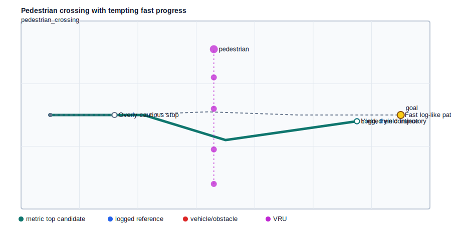
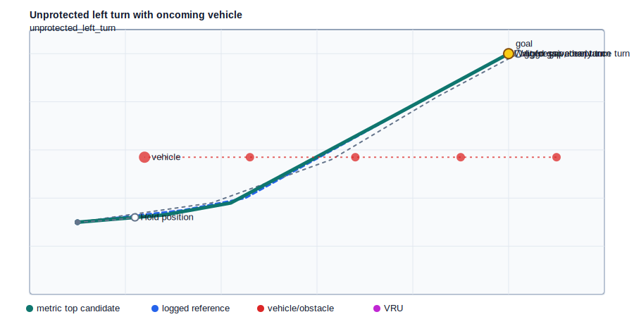
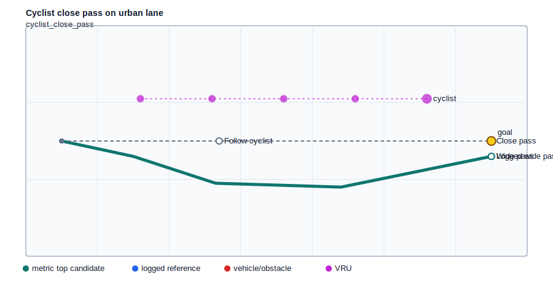
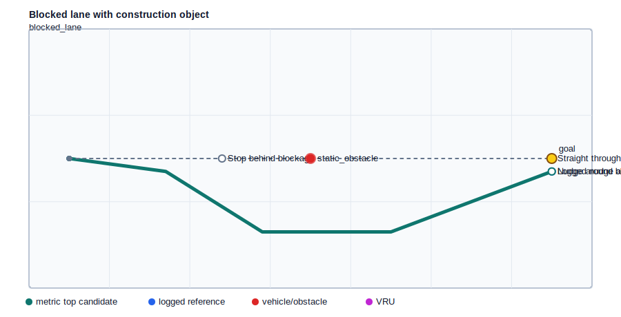
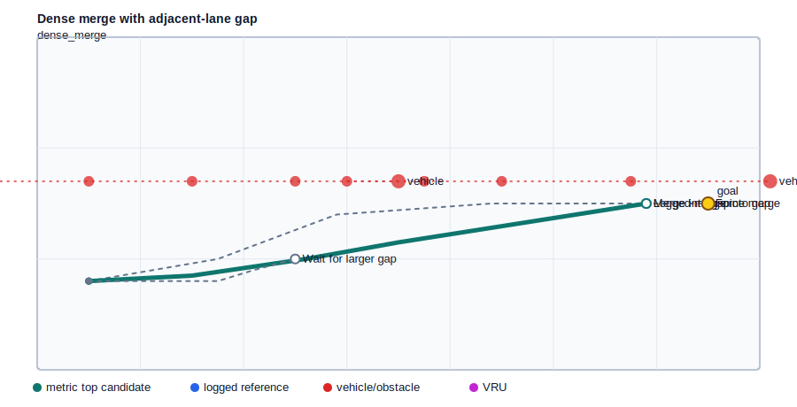
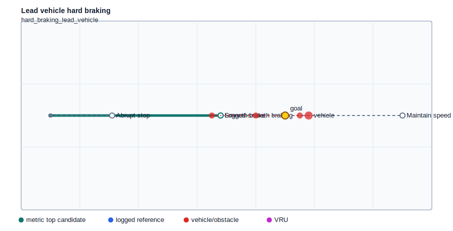

# Milestone 1: Synthetic Scenario Core

MetricDrive now has a controlled evaluation world: six long-tail driving scenarios, transparent planning metrics, ranked candidate trajectories, and SVG visualizations.

The point of this milestone is not model training yet. It is the measurement harness that makes later imitation and preference-alignment experiments meaningful.

## Summary

| Scenario | Category | Top candidate | Score | Progress | Collision clearance | VRU clearance | Offroad |
| --- | --- | --- | ---: | ---: | ---: | ---: | ---: |
| Pedestrian crossing with tempting fast progress | pedestrian_crossing | `metric_aligned_yield` | 11.416 | 10.487 | 0.640 | 2.040 | 0.000 |
| Unprotected left turn with oncoming vehicle | unprotected_left_turn | `metric_aligned_gap_turn` | 10.128 | 11.402 | 0.941 | n/a | 0.000 |
| Cyclist close pass on urban lane | cyclist_close_pass | `metric_aligned_wide_pass` | 13.405 | 11.600 | 0.735 | 2.335 | 0.000 |
| Blocked lane with construction object | blocked_lane | `metric_aligned_nudge` | 8.259 | 11.700 | 0.281 | n/a | 0.000 |
| Dense merge with adjacent-lane gap | dense_merge | `metric_aligned_gap_merge` | 9.141 | 10.881 | 0.483 | n/a | 0.000 |
| Lead vehicle hard braking | hard_braking_lead_vehicle | `metric_aligned_smooth_brake` | 5.780 | 5.800 | 0.900 | n/a | 0.000 |

## Scenario Gallery

### Pedestrian crossing with tempting fast progress

Proceed along the route while yielding to a pedestrian crossing from the right.

| Rank | Candidate | Score | Progress | Collision clearance | VRU clearance | Comfort | Imitation error |
| ---: | --- | ---: | ---: | ---: | ---: | ---: | ---: |
| 1 | `metric_aligned_yield` | 11.416 | 10.487 | 0.640 | 2.040 | 0.685 | 0.000 |
| 2 | `cautious_stop` | 7.773 | 2.200 | 2.395 | 3.795 | 0.000 | 2.956 |
| 3 | `imitation_fast_log` | -30.652 | 12.000 | -1.176 | 0.224 | 0.133 | 1.408 |

### Unprotected left turn with oncoming vehicle

Turn left through the intersection after accepting a safe oncoming gap.

| Rank | Candidate | Score | Progress | Collision clearance | VRU clearance | Comfort | Imitation error |
| ---: | --- | ---: | ---: | ---: | ---: | ---: | ---: |
| 1 | `metric_aligned_gap_turn` | 10.128 | 11.402 | 0.941 | n/a | 0.651 | 0.246 |
| 2 | `cautious_hold_position` | -2.650 | 1.054 | 0.408 | n/a | 0.121 | 4.216 |
| 3 | `imitation_aggressive_turn` | -31.878 | 11.202 | -1.590 | n/a | 0.642 | 0.897 |

### Cyclist close pass on urban lane

Pass the cyclist while maintaining clearance and route progress.

| Rank | Candidate | Score | Progress | Collision clearance | VRU clearance | Comfort | Imitation error |
| ---: | --- | ---: | ---: | ---: | ---: | ---: | ---: |
| 1 | `metric_aligned_wide_pass` | 13.405 | 11.600 | 0.735 | 2.335 | 0.580 | 0.000 |
| 2 | `cautious_follow` | 5.969 | 4.400 | 0.860 | 2.460 | 0.000 | 2.720 |
| 3 | `imitation_close_pass` | -6.822 | 12.000 | -0.500 | 1.100 | 0.000 | 0.688 |

### Blocked lane with construction object

Continue around a blocked lane without leaving the drivable region.

| Rank | Candidate | Score | Progress | Collision clearance | VRU clearance | Comfort | Imitation error |
| ---: | --- | ---: | ---: | ---: | ---: | ---: | ---: |
| 1 | `metric_aligned_nudge` | 8.259 | 11.700 | 0.281 | n/a | 1.258 | 0.000 |
| 2 | `cautious_stop_behind` | 0.560 | 3.800 | 0.400 | n/a | 0.000 | 3.280 |
| 3 | `imitation_straight_blocked` | -18.105 | 12.000 | -1.100 | n/a | 0.000 | 0.820 |

### Dense merge with adjacent-lane gap

Merge into the route lane without forcing adjacent traffic to brake hard.

| Rank | Candidate | Score | Progress | Collision clearance | VRU clearance | Comfort | Imitation error |
| ---: | --- | ---: | ---: | ---: | ---: | ---: | ---: |
| 1 | `metric_aligned_gap_merge` | 9.141 | 10.881 | 0.483 | n/a | 0.135 | 0.000 |
| 2 | `cautious_wait_merge` | -0.470 | 4.019 | -0.011 | n/a | 0.311 | 2.395 |
| 3 | `imitation_force_merge` | -4.585 | 12.081 | -0.535 | n/a | 0.510 | 0.943 |

### Lead vehicle hard braking

Maintain progress while braking smoothly behind a suddenly slowing lead vehicle.

| Rank | Candidate | Score | Progress | Collision clearance | VRU clearance | Comfort | Imitation error |
| ---: | --- | ---: | ---: | ---: | ---: | ---: | ---: |
| 1 | `metric_aligned_smooth_brake` | 5.780 | 5.800 | 0.900 | n/a | 0.000 | 0.000 |
| 2 | `cautious_hard_stop` | 3.445 | 2.100 | 3.400 | n/a | 0.000 | 1.860 |
| 3 | `imitation_maintain_speed` | -38.650 | 4.000 | -1.600 | n/a | 0.000 | 2.600 |

## Next Experiment

Use this harness to compare three methods: imitation baseline, metric reranking, and metric-derived preference alignment. The expected tradeoff is that metric alignment improves clearance and offroad behavior while sometimes increasing imitation error.
