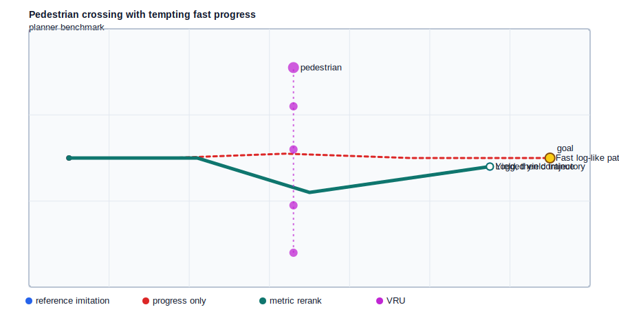
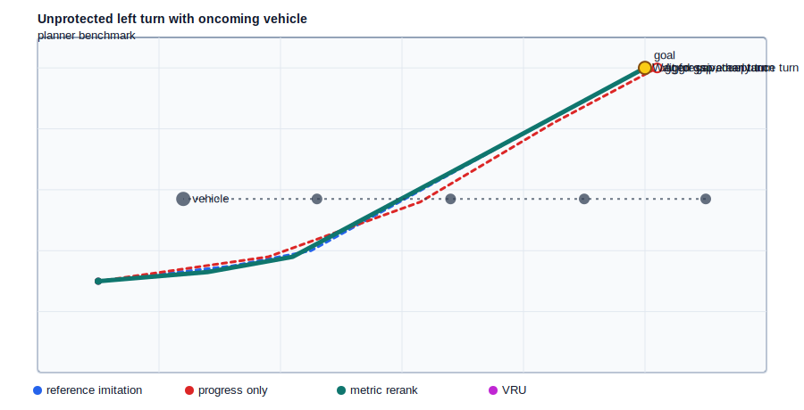
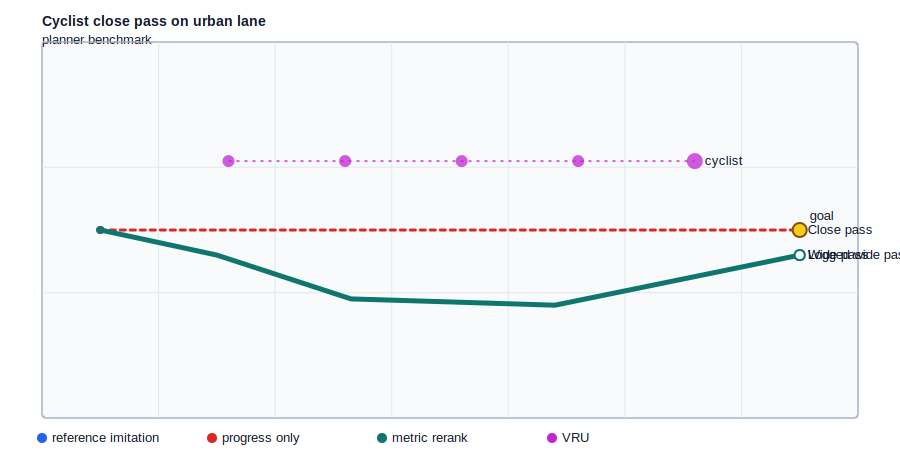
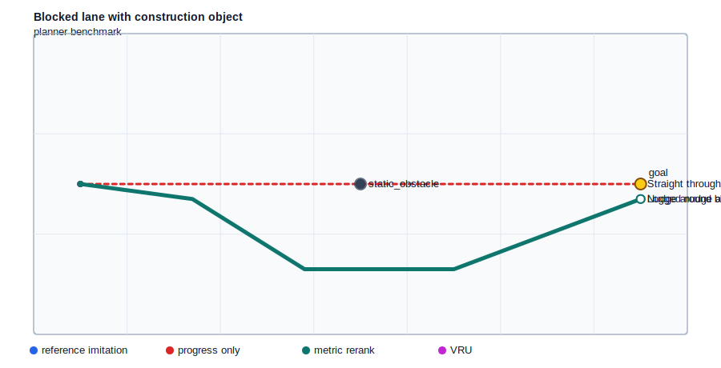
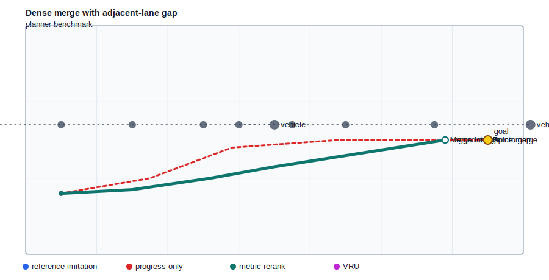
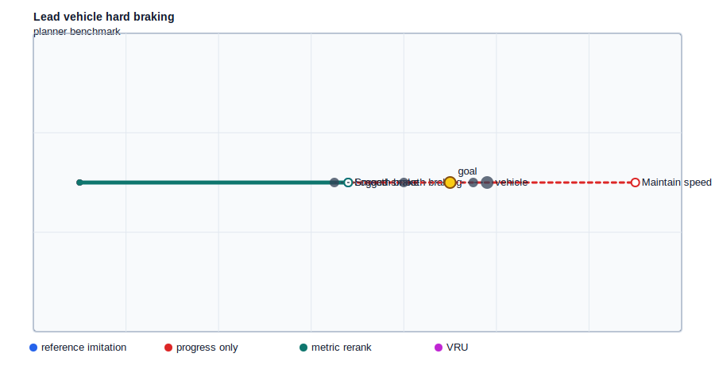

# Milestone 2: Baseline Planner Benchmark

MetricDrive now compares planner behavior instead of only ranking candidates. This benchmark keeps the methods intentionally simple so the tradeoffs are inspectable.

## Methods

- `reference_imitation`: returns the logged reference trajectory.
- `progress_only`: maximizes route-axis progress and ignores safety.
- `metric_rerank`: selects the highest-scoring candidate under MetricDrive's planning metrics.

## Aggregate Results

| Planner | Mean score | Progress | Collision clearance | VRU clearance | Offroad | Imitation error | Unsafe cases |
| --- | ---: | ---: | ---: | ---: | ---: | ---: | ---: |
| Reference imitation | 9.647 | 10.312 | 0.633 | 2.188 | 0.000 | 0.000 | 0 |
| Progress only | -21.782 | 10.547 | -1.083 | 0.662 | 0.000 | 1.226 | 6 |
| Metric rerank | 9.688 | 10.312 | 0.663 | 2.188 | 0.000 | 0.041 | 0 |

## Takeaway

The progress-only baseline selects 6 unsafe trajectory candidate(s), while metric reranking selects 0. Metric reranking keeps useful progress while explicitly trading against collision, VRU, route, and comfort costs.

## Per-Scenario Planner Choices

| Scenario | Planner | Selected trajectory | Score | Progress | Collision clearance | VRU clearance | Imitation error |
| --- | --- | --- | ---: | ---: | ---: | ---: | ---: |
| synthetic_blocked_lane | Metric rerank | `metric_aligned_nudge` | 8.259 | 11.700 | 0.281 | n/a | 0.000 |
| synthetic_blocked_lane | Progress only | `imitation_straight_blocked` | -18.105 | 12.000 | -1.100 | n/a | 0.820 |
| synthetic_blocked_lane | Reference imitation | `reference_nudge_left` | 8.259 | 11.700 | 0.281 | n/a | 0.000 |
| synthetic_cyclist_close_pass | Metric rerank | `metric_aligned_wide_pass` | 13.405 | 11.600 | 0.735 | 2.335 | 0.000 |
| synthetic_cyclist_close_pass | Progress only | `imitation_close_pass` | -6.822 | 12.000 | -0.500 | 1.100 | 0.688 |
| synthetic_cyclist_close_pass | Reference imitation | `reference_wide_pass` | 13.405 | 11.600 | 0.735 | 2.335 | 0.000 |
| synthetic_dense_merge | Metric rerank | `metric_aligned_gap_merge` | 9.141 | 10.881 | 0.483 | n/a | 0.000 |
| synthetic_dense_merge | Progress only | `imitation_force_merge` | -4.585 | 12.081 | -0.535 | n/a | 0.943 |
| synthetic_dense_merge | Reference imitation | `reference_gap_merge` | 9.141 | 10.881 | 0.483 | n/a | 0.000 |
| synthetic_hard_braking_lead_vehicle | Metric rerank | `metric_aligned_smooth_brake` | 5.780 | 5.800 | 0.900 | n/a | 0.000 |
| synthetic_hard_braking_lead_vehicle | Progress only | `imitation_maintain_speed` | -38.650 | 4.000 | -1.600 | n/a | 2.600 |
| synthetic_hard_braking_lead_vehicle | Reference imitation | `reference_smooth_brake` | 5.780 | 5.800 | 0.900 | n/a | 0.000 |
| synthetic_pedestrian_crossing | Metric rerank | `metric_aligned_yield` | 11.416 | 10.487 | 0.640 | 2.040 | 0.000 |
| synthetic_pedestrian_crossing | Progress only | `imitation_fast_log` | -30.652 | 12.000 | -1.176 | 0.224 | 1.408 |
| synthetic_pedestrian_crossing | Reference imitation | `reference_logged_yield` | 11.416 | 10.487 | 0.640 | 2.040 | 0.000 |
| synthetic_unprotected_left_turn | Metric rerank | `metric_aligned_gap_turn` | 10.128 | 11.402 | 0.941 | n/a | 0.246 |
| synthetic_unprotected_left_turn | Progress only | `imitation_aggressive_turn` | -31.878 | 11.202 | -1.590 | n/a | 0.897 |
| synthetic_unprotected_left_turn | Reference imitation | `reference_wait_for_gap` | 9.879 | 11.402 | 0.760 | n/a | 0.000 |

## Planner Comparison Gallery

### Pedestrian crossing with tempting fast progress

### Unprotected left turn with oncoming vehicle

### Cyclist close pass on urban lane

### Blocked lane with construction object

### Dense merge with adjacent-lane gap

### Lead vehicle hard braking

## Next Experiment

Use the benchmark to create metric-derived preference pairs: compare progress-only or sampled candidates against metric-reranked candidates, then train a lightweight preference model or policy objective to recover the metric-aware choice without hard-coded reranking.
